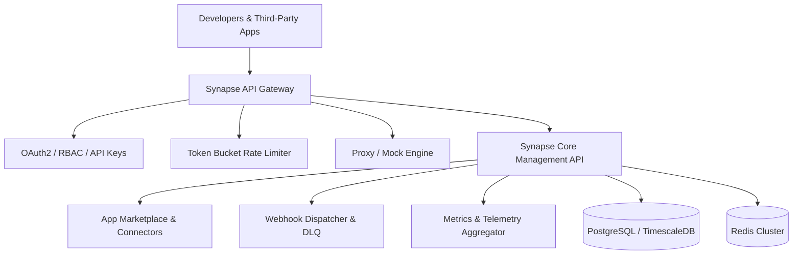

# Synapse

[](https://github.com/Chandravamsi09/Synapse-/actions/workflows/ci.yml)
[](LICENSE)
[](#)
[](https://www.typescriptlang.org/)
[](https://nodejs.org)

**Synapse** is an enterprise-grade, high-performance **App & API Management, Integration Gateway, and Developer Marketplace Platform**. It enables engineering teams to discover, orchestrate, secure, mock, and monitor APIs and third-party SaaS applications across distributed microservices.

---

## Key Features

- **API Gateway & Reverse Proxy**: Dynamic routing, header/payload transformations, JWT verification, and SSL termination.
- **Adaptive Rate Limiting & Circuit Breaking**: Token bucket and sliding-window rate limiters with automated failure detection.
- **App Marketplace & Connectors**: Pre-built integration connectors for Slack, GitHub, Stripe, Discord, Salesforce, Jira, Twilio, OpenAI, and AWS.
- **Webhook Orchestration Engine**: Asynchronous event dispatch with HMAC-SHA256 signature verification, exponential backoff, and dead-letter queues (DLQ).
- **Interactive Developer Portal & Sandbox**: Postman-style visual API tester, real-time response inspector, and auto-generated documentation.
- **Observability & Analytics**: Real-time traffic telemetry, latency histograms (P50/P90/P99), error budgets, and immutable audit logs.
- **Multi-Language SDKs**: Native, typed client SDKs for TypeScript, Python, and Go.

---

## Architecture Overview



---

## Monorepo Layout

```
Synapse/
├── apps/
│   ├── api/                 # Core NestJS/Express Backend API Engine
│   │   ├── src/
│   │   │   ├── auth/        # Authentication, OAuth2, RBAC, API Keys
│   │   │   ├── api-registry/# OpenAPI 3.0 parser, validator, mocking
│   │   │   ├── gateway/     # Reverse proxy, rate limiting, circuit breaker
│   │   │   ├── app-marketplace/ # Connectors (Slack, Stripe, GitHub, etc.)
│   │   │   ├── webhooks/    # Webhook delivery engine & retry queues
│   │   │   ├── analytics/   # Telemetry, metrics aggregation, audit logs
│   │   │   ├── billing/     # Metering, tier limits, subscriptions
│   │   │   └── database/    # Schemas, migrations, seeders
│   └── web/                 # Next.js 14 Developer Portal & Dashboard
├── packages/
│   ├── sdk-ts/              # Official TypeScript / JavaScript Client SDK
│   ├── sdk-python/          # Official Python Client SDK
│   ├── sdk-go/              # Official Go Client SDK
│   └── open-api-specs/      # OpenAPI 3.0/3.1 specs & Postman collections
├── tests/                   # Automated Unit, Integration & E2E Test Suite
├── .github/workflows/       # GitHub Actions CI/CD pipelines
└── docker/                  # Dockerfiles and docker-compose configurations
```

---

## Quick Start

### Prerequisites
- Node.js >= 18.0.0
- Docker & Docker Compose (optional, for PostgreSQL/Redis services)

### Running Locally
```bash
# Install dependencies
npm install

# Run automated test suites
npm test

# Start the Synapse API server
npm run start:api

# Start the Developer Portal
npm run start:web
```

---

## License
MIT License. Copyright (c) 2026 Synapse Engineering Team.
